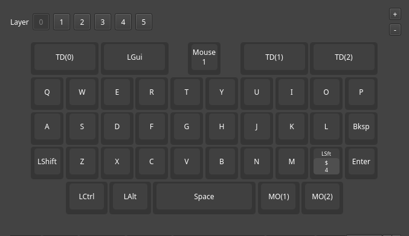
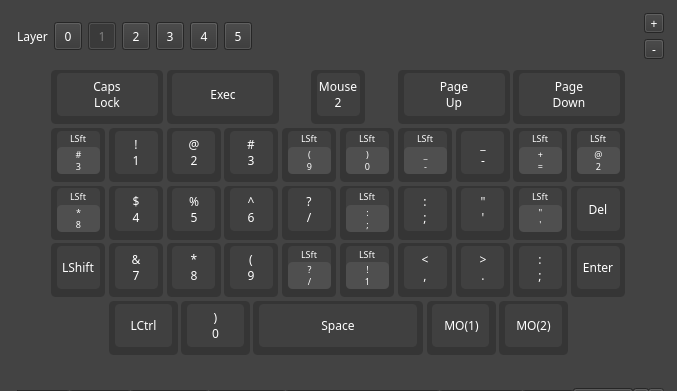
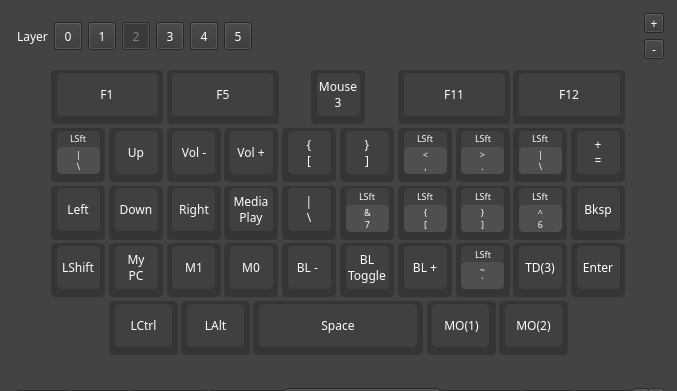

# Hackberry Pi CM5 — Modified Linux Layout  
Custom key‑layer configuration for the Zitaotech's  [Hackberry Pi CM5](https://github.com/ZitaoTech/HackberryPiCM5/tree/main), focused on improving Linux terminal workflows and system control.

---

## Layer2 Additions (Linux‑Optimized)

- **Ctrl+Shift+C** — assigned to **C key**  
  Standard Linux terminal copy shortcut.

- **Ctrl+Shift+V** — assigned to **X key**  
  Standard Linux terminal paste shortcut.

- **Middle Click** — assigned to **Mouse Click**  
  Useful for closing tabs or pasting primary selection.

- **Open Files** — assigned to **Z key**  
  Quick access to the file manager.

- **Volume Down** — assigned to **E key**

- **Volume Up** — assigned to **R key**

- **Media Play/Pause** — assigned to **F key**

---

## Layout Images

